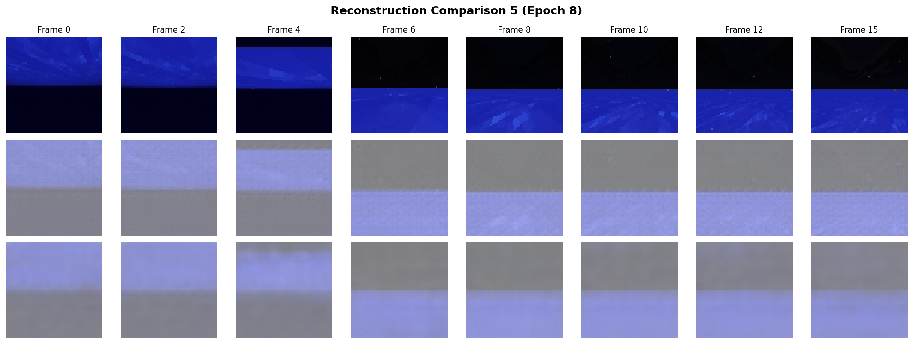
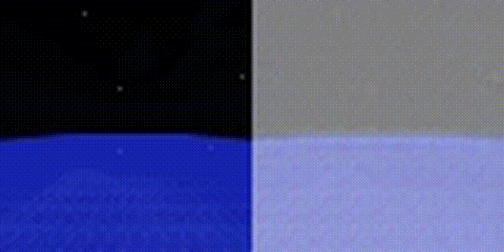
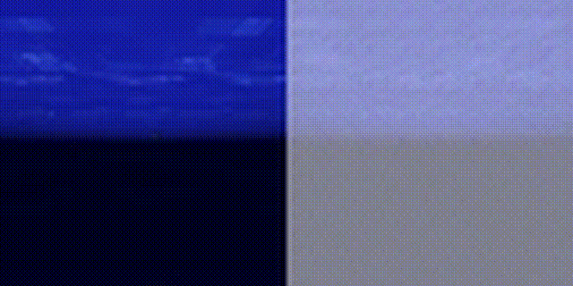
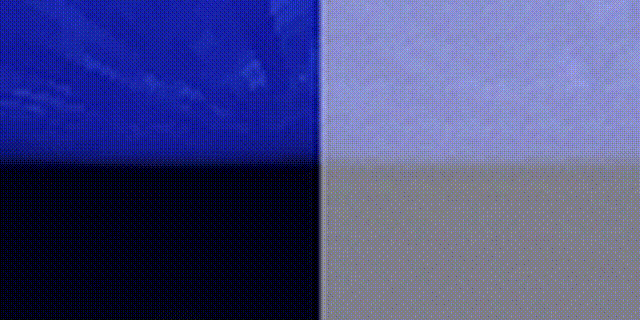

# GPU/COMPUTE NEEDED IS NOT GOING TO BE ADEQUATE FOR TRAINING TOKENIZER, DYNAMICS AND RL

with current RTX 3060 GPU, training on the full dataset may take a month or more. Debugging etc is going to be even hard- not conducive to quick iterative learning. 
Reports with 12x more GPU compute show the tokenizer learns granular forms which affects in the subsequent learning process. 
- Reference: https://github.com/HKimiwada/Dreamer4
- Trained on 8x 16GB V100 GPUs using data from zhwang4ai/OpenAI-Minecraft-Contractor (pixel/frame is not different than current config)

## PROJECT STATUS: ABANDONED FOR NOW

## Reference Implementations Reviewed

| Implementation | Source | Target Domain | GPU Requirements |
|----------------|--------|---------------|------------------|
| **Dreamer4** | V100 impl | Minecraft/Atari | 8× 16GB V100 |
| **dreamer4-experiments** | lucidrains | Generic | Not specified |
| **dreamer4** | Nicklas Hansen | DMControl (30 tasks) | 8× 24GB RTX 3090 |

---

## Dataset Comparison

| Dataset | Frames | Resolution | Storage | Trajectories |
|---------|--------|------------|---------|--------------|
| **Our MineRL (full)** | 4,350,893 | 64×64 | 52GB | 759 |
| **Our MineRL (subset)** | 71,279 | 64×64 | 864MB | 10 |
| **Hansen DMControl** | 3,600,000 | 128×128 | 350GB (processed) | 7,200 |
| **OpenAI Contractor** | Millions | 360×640 | Large | Thousands |

# P.S: 
It did learn to predict pixels with epoch 9. 

## GROUND_TRUTH VS RECONSTRUCTION

Dreamer 4 absorbs the majority of its knowledge from unlabeled videos, and requires only a small amount of videos paired with actions.

MineRL is fully labeled (every frame has expert actions). You're wasting compute feeding high-entropy action embeddings when the model needs unlabeled diversity to learn physics. The 2B parameters will overfit to the 759 trajectories instead of learning generalizable world simulation.

The paper uses 360×640 (VPT) or at least 128×128 (DMControl). At 64×64:
Inventory/crafting UI is illegible (critical for diamonds)
Block textures blur together (diamond ore vs stone)
Mouse cursor is invisible (needed for action grounding)